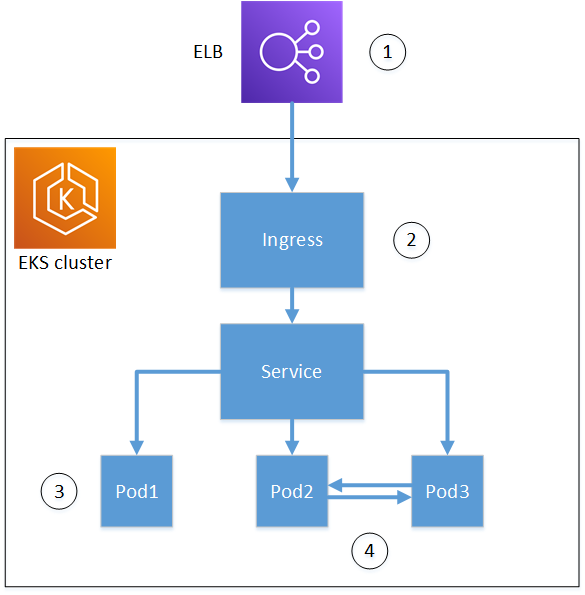

Kubernetes containers and applications use digital certificates to provide secure authentication and encryption over TLS. A widely adopted solution for TLS certificate life-cycle management in Kubernetes is cert-manager, an add-on to Kubernetes that requests certificates, distributes them to Kubernetes containers, and automates certificate renewal.

ACM Private CA provides an open-source plug-in to cert-manager, [aws-privateca-issuer](https://github.com/cert-manager/aws-privateca-issuer), that allows customers who use cert-manager to improve security over the default cert-manager CA, which stores keys in plaintext in server memory. Customers with regulatory requirements for controlling access to and auditing their CA operations can use this solution to improve auditability and support compliance. You can use the AWS Private CA Issuer plugin with Amazon Elastic Kubernetes Service (Amazon EKS), a self-managed Kubernetes on AWS, or in on-premises Kubernetes.

The diagram below shows some of the options available for using TLS with a Kubernetes cluster. This example cluster, containing various resources, is situated behind a load balancer. The numbers identify possible end-points for TLS-secured communications, including the external load balancer, the ingress controller, an individual pod within a service, and a pair of pods communicating securely with each other.

1. Termination at the load balancer.

    Elastic Load Balancing (ELB) is an AWS Certificate Manager integrated service, which means that you can provision ACM with a private CA, sign a certificate with it, and install it using using the ELB console. This solution provides encrypted communication between a remote client and the load balancer. Data is passed unencrypted to the EKS cluster. Alternatively, you could provide a private certificate to a non-AWS load balancer to terminate TLS.

2. Termination at the Kubernetes ingress controller.

    The ingress controller resides inside the EKS cluster as a native load balancer and router. If you have installed both cert-manager and aws-privateca-issuer, and provisioned the cluster with a private CA, Kubernetes can install a signed TLS certificate on the controller, allowing it to serve as the cluster's end-point for external communications. Communications between the load balancer and the ingress controller are encrypted, and after ingress, data passes unencrypted to the cluster's resources.

3. Termination at a pod.

    Each pod is a group of one or more containers (for example, Docker containers) that share storage and network resources. If you have installed both cert-manager and aws-privateca-issuer, and provisioned the cluster with a private CA, Kubernetes can install a signed TLS certificates on pods as needed. A TLS connection terminating at a pod is unavailable by default to other pods in the cluster.

4. Secure communications between pods.

    You can also provision multiple pods with certificates that allow them to communicate with one another. The following scenarios are possible:

    * Provisioning with Kubernetes-generated self-signed certificates. This secures communications between pods, but self-signed certificates do not satisfy HIPAA or FIPS requirements.

    * Provisioning with certificates signed by a private CA. As in numbers 2 and 3 above, this requires installing both cert-manager and aws-privateca-issuer, and provision the cluster with a private CA. Kubernetes can then install signed TLS certificates on the pods as needed.

---
## Cross-account use of the cert-manager

Administrators with cross-account access to a CA can use cert-manager to provision a Kubernetes cluster. For more information, see [Cross-account access to private CAs](https://docs.aws.amazon.com/acm-pca/latest/userguide/pca-resource-sharing.html).

> **_NOTE:_**  
Only certain ACM Private CA certificate templates can be used in cross-account scenarios. See [Supported certificate templates](#supported-certificate-templates) for a list of available templates.

---
## Supported certificate templates

The following table lists ACM Private CA templates that can be used with cert-manager to provision a Kubernetes cluster.

| Templates supported for Kubernetes | Support for cross-account use |
| --- | :---: |
| [BlankEndEntityCertificate_CSRPassthrough/V1](https://docs.aws.amazon.com/acm-pca/latest/userguide/UsingTemplates.html#BlankEndEntityCertificate_CSRPassthrough) | |
| [CodeSigningCertificate/V1](https://docs.aws.amazon.com/acm-pca/latest/userguide/UsingTemplates.html#CodeSigningCertificate-V1) | |
| [EndEntityCertificate/V1](https://docs.aws.amazon.com/acm-pca/latest/userguide/UsingTemplates.html#EndEntityCertificate-V1)  | 	✓ |
| [EndEntityClientAuthCertificate/V1](https://docs.aws.amazon.com/acm-pca/latest/userguide/UsingTemplates.html#EndEntityClientAuthCertificate-V1)  | 	✓ |
| [EndEntityServerAuthCertificate/V1](https://docs.aws.amazon.com/acm-pca/latest/userguide/UsingTemplates.html#EndEntityServerAuthCertificate-V1)  | 	✓ |

---
## Example solutions

The following integration solutions show how to configure access to ACM Private CA on an Amazon EKS cluster.

* [TLS-enabled Kubernetes clusters with ACM Private CA and Amazon EKS](https://aws.amazon.com/blogs/security/tls-enabled-kubernetes-clusters-with-acm-private-ca-and-amazon-eks-2/)

* [Setting up end-to-end TLS encryption on Amazon EKS with the new AWS Load Balancer Controller](https://aws.amazon.com/blogs/containers/setting-up-end-to-end-tls-encryption-on-amazon-eks-with-the-new-aws-load-balancer-controller/)